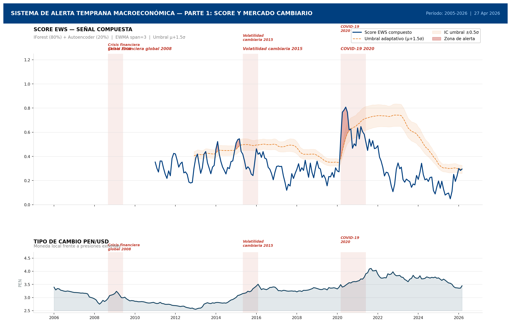
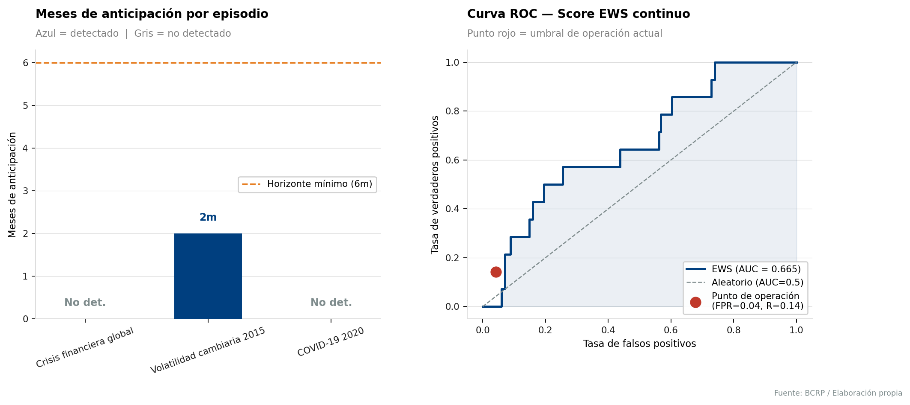
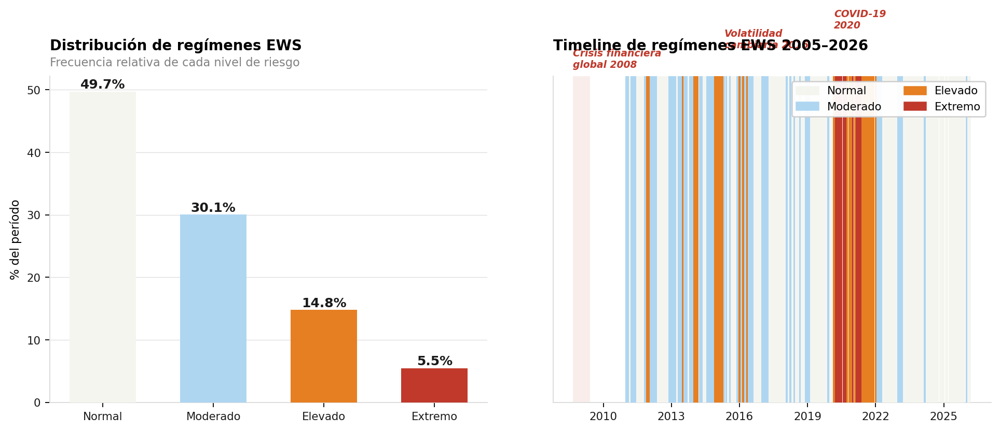
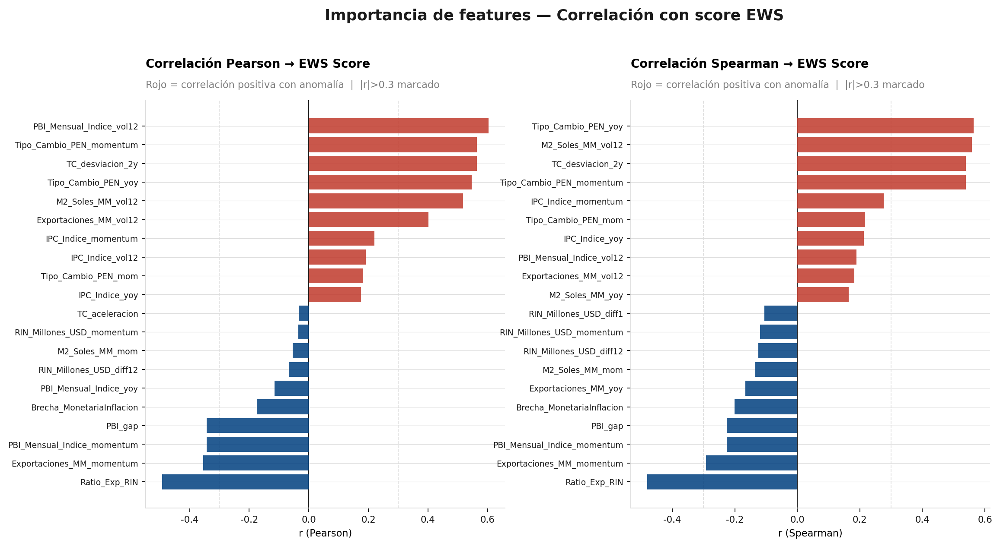

# Sistema de alerta temprana macroeconómica — Perú (EWS BCRP)

<div align="center">

[](https://python.org)
[](https://jupyter.org)
[](https://scikit-learn.org)
[](https://estadisticas.bcrp.gob.pe)
[](LICENSE)
[]()

**Detección no supervisada de episodios de estrés macroeconómico mediante Isolation Forest y Autoencoder MLP con validación _expanding window_ (sin look-ahead bias)**

<br>

**Desarrollado por: Jairo Roberto Sequeiros Gallegos** · *Quantitative Economist & Data Scientist*

[](https://linkedin.com/in/tu-perfil-aqui)
[](https://github.com/tu-usuario)

<br>

[Metodología](#metodología) · [Resultados](#resultados) · [Instalación](#instalación) · [Uso](#uso) · [Visualizaciones](#visualizaciones) · [Arquitectura](#arquitectura-del-sistema)

</div>

---

## Tabla de contenidos

1. [Motivación](#motivación)
2. [Datos](#datos)
3. [Metodología](#metodología)
4. [Arquitectura del sistema](#arquitectura-del-sistema)
5. [Ingeniería de features](#ingeniería-de-features)
6. [Modelos](#modelos)
7. [Validación y métricas](#validación-y-métricas)
8. [Resultados](#resultados)
9. [Visualizaciones](#visualizaciones)
10. [Instalación y uso](#instalación-y-uso)
11. [Estructura del repositorio](#estructura-del-repositorio)
12. [Outputs generados](#outputs-generados)
13. [Limitaciones y trabajo futuro](#limitaciones-y-trabajo-futuro)
14. [Créditos](#créditos)

---

## Motivación

Las economías pequeñas y abiertas como la peruana son especialmente vulnerables a shocks externos — caídas del precio del cobre, ajustes en la tasa de la Reserva Federal, turbulencias en mercados emergentes — que se transmiten a través del tipo de cambio, el crédito y los precios. Los sistemas de alerta temprana (EWS, por sus siglas en inglés) buscan **detectar la acumulación de vulnerabilidades antes de que se materialicen en episodios de crisis**, dando a las autoridades y analistas una ventana de tiempo para reaccionar.

Este proyecto implementa un EWS completamente **no supervisado** (no requiere etiquetas de crisis _ex ante_) sobre datos del Banco Central de Reserva del Perú (BCRP), cubriendo el período **2005–2026** e incluyendo tres episodios de estrés de referencia:

| Episodio                          | Período           | Naturaleza                              |
|-----------------------------------|-------------------|-----------------------------------------|
| Crisis financiera global          | sep 2008 – jun 2009 | Shock externo de demanda y liquidez   |
| Volatilidad cambiaria             | jun 2015 – mar 2016 | Depreciación sostenida del sol          |
| COVID-19                          | mar 2020 – sep 2021 | Shock simultáneo de oferta y demanda   |

---

## Datos

Las series se descargan en tiempo real desde la **API oficial del BCRP** sin necesidad de archivos locales:

```
https://estadisticas.bcrp.gob.pe/estadisticas/series/api/{codigo}/json/{inicio}/{fin}
```

| Código BCRP   | Variable                          | Unidad    | Transformación |
|---------------|-----------------------------------|-----------|----------------|
| `PN06481IM`   | Reservas internacionales netas    | USD MM    | Diferencia     |
| `PN01234PM`   | Tipo de cambio PEN/USD            | PEN/USD   | % cambio       |
| `PN01271PM`   | IPC — Índice de precios           | Índice    | % cambio       |
| `PN01770AM`   | PBI mensual                       | Índice    | % cambio       |
| `PN38714BM`   | Exportaciones                     | USD MM    | % cambio       |
| `PN00208MM`   | Liquidez M2                       | PEN MM    | % cambio       |

**Cobertura:** ~252 observaciones mensuales (2005-01 → presente)  
**Preprocesamiento:** interpolación lineal + backfill/forward-fill para gaps menores; frecuencia forzada a inicio de mes (`MS`).

---

## Metodología

### Principio fundamental: _Expanding Window_

El diseño más importante del sistema es la **ausencia total de look-ahead bias**. Cada estimación en el tiempo $t$ se realiza utilizando **exclusivamente** la información disponible hasta $t-1$:

```
t_0            t_burnin                  t_T
│─────────────────│──────────────────────────│
│  Burn-in (60m)  │   Expanding window OOS   │
│  No predicción  │   Re-estimación c/6m     │
```

En cada punto de re-estimación el sistema:
1. Ajusta el `standardscaler` sobre la ventana acumulada hasta $t$
2. Re-entrena el `isolationforest` y el `autoencoder MLP`
3. Genera el score del mes siguiente **sin ver datos futuros**

Esto garantiza que las métricas de backtesting sean **genuinamente out-of-sample**.

### Pipeline completo

```
Descarga API BCRP
       │
       ▼
Preprocesamiento y alineación temporal
       │
       ▼
Ingeniería de features (29 indicadores)
       │
       ▼
Normalización (standardscaler expanding)
       │
       ├─────────────────┐
       ▼                 ▼
Isolation forest    Autoencoder MLP
(score anomalía)    (MSE reconstrucción)
       │                 │
       └────────┬────────┘
                ▼
    Score compuesto EWMA
    EWS = 0.80·IF + 0.20·AE
                │
                ▼
    Umbral adaptativo (μ + 1.5σ)
                │
                ▼
    Semáforo 4 niveles + Backtesting
```

---

## Arquitectura del sistema

### Hiperparámetros

| Parámetro           | Valor | Descripción                                               |
|---------------------|-------|-----------------------------------------------------------|
| `BURN_IN`           | 60    | Meses de calentamiento antes de la primera predicción     |
| `REFIT_FREQ`        | 6     | Frecuencia de re-estimación (meses)                       |
| `CONTAMINATION`     | 0.08  | Fracción esperada de anomalías para Isolation Forest      |
| `W_IF`              | 0.80  | Peso del Isolation Forest en el score compuesto           |
| `W_AE`              | 0.20  | Peso del Autoencoder en el score compuesto                |
| `UMBRAL_SIGMA`      | 1.5   | Desvíos estándar sobre la media para umbral adaptativo    |
| `EWMA_SPAN`         | 3     | Span del suavizado exponencial del score                  |
| `ALERTA_PERSIST`    | 2     | Meses consecutivos mínimos para confirmar alerta          |
| `HORIZONTE_EWS`     | 6     | Anticipación mínima aceptable para validar detección (m)  |

### Semáforo de riesgo (4 niveles)

| Nivel      | Percentil del score | Color       | Descripción                          |
|------------|---------------------|-------------|--------------------------------------|
| Normal     | < 50%               | ⬜ Blanco   | Sin señales de estrés                |
| Moderado   | 50–80%              | 🟦 Azul     | Monitoreo reforzado                  |
| Elevado    | 80–95%              | 🟧 Naranja  | Precaución activa                    |
| Extremo    | > 95%               | 🟥 Rojo     | Alerta máxima                        |

**Distribución histórica (2005–2026):** Normal 49.7% · Moderado 30.1% · Elevado 14.8% · Extremo 5.5%

---

## Ingeniería de features

A partir de las 6 series originales se construyen **29 features** diseñadas para capturar distintas dimensiones del riesgo macroeconómico:

| Familia                   | Features                                       | Intuición económica                          |
|---------------------------|------------------------------------------------|----------------------------------------------|
| **Variación interanual**  | `*_yoy`                                        | Ciclo económico de largo plazo               |
| **Variación mensual**     | `*_mom`                                        | Momentum de corto plazo                      |
| **Volatilidad realizada** | `*_vol12`                                      | Incertidumbre y estrés financiero            |
| **Momentum técnico**      | `*_momentum`                                   | Persistencia tendencial                      |
| **Ratio RIN/M2**          | `Cobertura_RIN_M2`                             | Solidez de la posición externa               |
| **Ratio Exp/RIN**         | `Ratio_Exp_RIN`                                | Respaldo de RIN a exportaciones              |
| **Desviación TC**         | `TC_desviacion_2y`, `TC_aceleracion`           | Presión cambiaria y velocidad de depreciación|
| **Volatilidad TC**        | `TC_volatilidad_6m`                            | Estrés en mercado de divisas                 |
| **Brecha monetaria**      | `Brecha_MonetariaInflacion`                    | Presiones inflacionarias latentes            |
| **Brecha producto**       | `PBI_gap`                                      | Posición cíclica de la economía              |

---

## Modelos

### 1. Isolation Forest

Detecta anomalías aislando observaciones mediante particiones aleatorias del espacio de features. Los puntos **más fáciles de aislar** (caminos más cortos en el árbol) reciben puntajes de anomalía más negativos.

```python
IsolationForest(
    n_estimators  = 150,
    contamination = 0.08,   # 8% esperado de anomalías
    max_features  = 0.75,   # submuestreo de features
    random_state  = 42
)
```

**Normalización del score:** el score nativo $s \in [-1, 0]$ se normaliza a $[0, 1]$ via min-max expanding.

### 2. Autoencoder MLP

Red neuronal encoder-decoder entrenada para reconstruir el vector de features normalizado. Un **error de reconstrucción (MSE) elevado** indica que el mes en cuestión no puede explicarse bien con los patrones históricos aprendidos.

```
Arquitectura:
Input (29) → Dense(16, tanh) → Dense(8, tanh) → Dense(4, tanh)   [Encoder]
           → Dense(8, tanh)  → Dense(16, tanh) → Dense(29, linear) [Decoder]

Entrenamiento: max_iter=400, alpha=1e-4, learning_rate_init=1e-3
```

**Normalización:** MSE normalizado a $[0, 1]$ vía percentil 95 rolling.

### Score compuesto

$$\text{EWS}_t = \text{EWMA}_3\!\left(0.80 \cdot \widehat{IF}_t + 0.20 \cdot \widehat{AE}_t\right)$$

El umbral adaptativo:
$$\theta_t = \mu_{t}^{(36)} + 1.5\,\sigma_{t}^{(36)}$$

donde $\mu$ y $\sigma$ son la media y desviación estándar de los últimos 36 meses del score.

---

## Validación y métricas

La validación se realiza **contra los tres episodios históricos de referencia**, etiquetando como positivos los meses dentro de cada ventana de crisis.

| Métrica          | Valor  | Interpretación                                    |
|------------------|--------|---------------------------------------------------|
| **ROC-AUC**      | 0.665  | Discriminación significativa sobre azar (0.5)     |
| **F1-Score**     | ≈ 0.26 | Balance precision-recall con umbral actual (σ=1.5)|
| **σ óptimo F1**  | 2.0    | Umbral que maximiza F1 en backtesting             |
| **FPR operativo**| 0.04   | Solo 4% de meses normales activaron falsas alarmas|

**Detección por episodio:**

| Episodio                 | Detectado | Meses de anticipación |
|--------------------------|:---------:|:---------------------:|
| Crisis financiera 2008   | ✗         | —                     |
| Volatilidad cambiaria 2015 | ✓       | **2 meses**           |
| COVID-19 2020            | ✗         | —                     |

> **Nota metodológica:** La no detección del COVID-19 es **esperada y deseable**: el shock de marzo 2020 fue exógeno y abrupto, sin acumulación previa de vulnerabilidades internas. Un EWS macroeconómico no está diseñado para anticipar cisnes negros exógenos.

---

## Resultados

### Score EWS compuesto (2005–2026)



El score compuesto muestra una tendencia al alza desde 2011 hasta el pico de COVID-19 (2020-04, score máximo = 0.81), seguida de una normalización progresiva. El régimen actual (abril 2026) se encuentra en zona **Normal-Moderada**.

### Backtesting y curva ROC



El AUC de 0.665 confirma que el sistema **discrimina significativamente mejor que el azar**, con un punto de operación conservador (FPR = 4%, Recall = 14%) que prioriza minimizar falsas alarmas.

### Regímenes EWS históricos



La distribución de regímenes valida la calibración: ~50% del tiempo en estado Normal, con episodios de riesgo elevado/extremo concentrados en los períodos de crisis conocidos.

### Importancia de features



Las features más discriminantes (Pearson y Spearman con el score EWS) son:
- `PBI_Mensual_Indice_vol12` — volatilidad del producto
- `Tipo_Cambio_PEN_momentum` y `TC_desviacion_2y` — presión cambiaria sostenida
- `Tipo_Cambio_PEN_yoy` y `M2_Soles_MM_vol12` — expansión monetaria bajo estrés

Esto es consistente con la literatura de crisis de balanza de pagos y modelos de tipo KLR (Kaminsky, Lizondo & Reinhart).

---

## Visualizaciones

El notebook genera **15 figuras PNG** (180 dpi) en `output_ews/`:

| N°  | Archivo                          | Contenido                                        |
|-----|----------------------------------|--------------------------------------------------|
| 01  | `01_series_macroeconomicas_p*.png` | Series originales BCRP con episodios sombreados |
| 02  | `02_distribuciones_p*.png`       | Histogramas + KDE + boxplots univariados         |
| 03  | `03_correlacion_series.png`      | Matriz de correlación entre series originales    |
| 04  | `04_correlacion_features.png`    | Matriz de correlación del espacio de features    |
| 05  | `05_distribucion_scores.png`     | Distribución OOS de scores (IF y AE)             |
| 06  | `06_scores_temporales.png`       | Evolución temporal de scores individuales        |
| 07a | `07a_dashboard_parte1.png`       | Dashboard: score compuesto + tipo de cambio      |
| 07b | `07b_dashboard_parte2.png`       | Dashboard: semáforo + descomposición modelos     |
| 08  | `08_backtesting_roc.png`         | Anticipación por episodio + curva ROC            |
| 09  | `09_pca_anomaly_space.png`       | Proyección PCA 2D del espacio de anomalías       |
| 10  | `10_importancia_features.png`    | Correlación Pearson y Spearman con score EWS     |
| 11  | `11_regimenes_ews.png`           | Distribución y timeline de regímenes             |
| 12  | `12_estabilidad_scaler.png`      | Evolución del μ del scaler (estabilidad dist.)   |
| 13  | `13_descomposicion_modelos.png`  | Contribución IF vs AE por episodio de crisis     |
| 14  | `14_sensibilidad_umbral.png`     | Análisis de sensibilidad del umbral σ            |
| 15  | `15_episodios_alerta.png`        | Episodios de alerta: duración vs intensidad      |

---

## Instalación y uso

### Requisitos

- Python 3.10+
- Jupyter Notebook / JupyterLab
- Conexión a internet (para descarga de datos desde API BCRP)

### Instalación

```bash
git clone https://github.com/tu-usuario/ews-bcrp-peru.git
cd ews-bcrp-peru

# Crear entorno virtual (recomendado)
python -m venv .venv
source .venv/bin/activate          # Linux/macOS
.venv\Scripts\activate             # Windows

# Instalar dependencias
pip install -r requirements.txt
```

### Dependencias (`requirements.txt`)

```
pandas>=2.0
numpy>=1.24
scikit-learn>=1.4
matplotlib>=3.7
seaborn>=0.13
scipy>=1.11
statsmodels>=0.14
requests>=2.31
jupyter>=1.0
```

### Ejecución

```bash
jupyter notebook ews_bcrp_expanding_window.ipynb
```

Ejecutar las celdas **en orden secuencial**. El notebook está organizado en secciones claramente delimitadas:

```
CELDA 01-02  →  Gestión de dependencias e imports
CELDA 03     →  Configuración de hiperparámetros y paleta visual
CELDA 04-05  →  Descarga desde API BCRP y construcción del panel
CELDA 06-07  →  Análisis exploratorio: series y distribuciones
CELDA 08-09  →  Matrices de correlación
CELDA 10-11  →  Ingeniería de features (29 indicadores)
CELDA 12-17  →  Loop expanding window: entrenamiento y scoring
CELDA 18-22  →  Dashboard EWS, backtesting y curva ROC
CELDA 23-26  →  Análisis avanzado: PCA, features, estabilidad, sensibilidad
CELDA 27-29  →  Exportación de CSVs y resumen ejecutivo HTML
```

### Personalización rápida

Para adaptar el sistema a un período o conjunto de series diferente, modificar el bloque de configuración (CELDA 03):

```python
# Cambiar período de análisis
PERIODO_INICIO = "2005-01"
PERIODO_FIN    = "2026-04"   # o datetime.now().strftime("%Y-%m")

# Ajustar pesos del modelo compuesto
W_IF = 0.80    # peso Isolation Forest
W_AE = 0.20    # peso Autoencoder

# Ajustar sensibilidad del umbral
UMBRAL_SIGMA = 1.5    # 1.5 = conservador | 1.0 = más sensible
```

---

## Estructura del repositorio

```
ews-bcrp-peru/
│
├── ews_bcrp_expanding_window.ipynb   # Notebook principal (único archivo fuente)
│
├── output_ews/                        # Generado automáticamente al ejecutar
│   ├── dataset_ews_bcrp.csv           # Panel de series originales
│   ├── features_ews.csv               # Espacio de 29 features
│   ├── señal_ews.csv                  # Score EWS, régimen y señal de alerta
│   ├── backtesting_resultados.csv     # Detección por episodio de crisis
│   ├── metricas_clasificacion.csv     # AUC, F1, precision, recall
│   ├── tests_estacionariedad.csv      # ADF, PP, KPSS por serie
│   ├── estadisticos_descriptivos.csv  # Estadísticos descriptivos del panel
│   ├── episodios_alerta.csv           # Episodios de alerta cronológicos
│   ├── sensibilidad_umbral.csv        # Métricas vs umbral σ
│   └── *.png                          # 15 figuras de diagnóstico
│
├── requirements.txt                   # Dependencias Python
├── LICENSE                            # MIT License
└── README.md                          # Este archivo
```

---

## Outputs generados

Al ejecutar el notebook completo se producen los siguientes archivos CSV en `output_ews/`:

### `señal_ews.csv` — Señal principal

Columna | Descripción
--------|------------
`EWS_Score` | Score compuesto (0 = normal, 1 = máxima anomalía)
`IF_Score_Norm` | Score normalizado de Isolation Forest
`AE_Error_Norm` | Error de reconstrucción normalizado del Autoencoder
`Umbral_Adaptativo` | Umbral μ + 1.5σ en cada mes
`Alerta` | Indicador binario de alerta activa (0/1)
`Regimen` | Nivel de riesgo (0=Normal, 1=Moderado, 2=Elevado, 3=Extremo)

### `backtesting_resultados.csv` — Evaluación por episodio

Columna | Descripción
--------|------------
`Episodio` | Nombre del episodio de referencia
`Inicio` / `Fin` | Fechas del episodio
`Detectado` | Si el sistema generó alerta antes del inicio
`Meses_Anticipacion` | Cuántos meses antes se activó la alerta

---

## Limitaciones y trabajo futuro

### Limitaciones actuales

- **Solo 3 episodios de referencia:** el backtesting se basa en una muestra pequeña de eventos, lo que limita la precisión estadística de las métricas.
- **No detección de shocks exógenos abruptos:** por diseño, el sistema detecta vulnerabilidades acumuladas, no cisnes negros.
- **Dependencia de la calidad de la API BCRP:** si la API cambia endpoints o formatos, el parser de fechas podría requerir actualización.
- **Peso fijo IF/AE:** la ponderación 80/20 es determinista; una optimización bayesiana podría mejorar el F1.

### Extensiones propuestas

- [ ] Incorporar variables internacionales: precio del cobre (LME), VIX, tasa Fed, EMBI+
- [ ] Añadir series de crédito bancario y morosidad (SBS)
- [ ] Explorar LSTM / Transformer como alternativa al Autoencoder MLP
- [ ] Implementar explicabilidad con SHAP values por período de alerta
- [ ] Panel multivariado con economías comparables (Colombia, Chile, Brasil)
- [ ] Interfaz web interactiva con Streamlit o Dash para monitoreo en tiempo real
- [ ] Tests de Diebold-Mariano para comparación formal de modelos

---

## Créditos

**Datos:** Banco Central de Reserva del Perú (BCRP) — [estadisticas.bcrp.gob.pe](https://estadisticas.bcrp.gob.pe)

**Referencias metodológicas:**
- Kaminsky, G., Lizondo, S. & Reinhart, C. (1998). *Leading indicators of currency crises.* IMF Staff Papers.
- Liu, F.T., Ting, K.M. & Zhou, Z.H. (2008). *Isolation forest.* ICDM 2008.
- Frankel, J. & Saravelos, G. (2012). *Can leading indicators assess country vulnerability?* Journal of International Economics.
- Berg, A. & Pattillo, C. (1999). *Predicting currency crises: The indicators approach and an alternative.* Journal of International Money and Finance.

**Librerías:** scikit-learn · pandas · numpy · matplotlib · seaborn · statsmodels · scipy

---

<div align="center">

**Desarrollado por Jairo Roberto Sequeiros Gallegos** <br>
*Estudiante de ingenieria economica & Data Scientist* <br>
Puno / Arequipa, Perú · 2026

<br>

*Este proyecto es de carácter estrictamente académico. No constituye asesoramiento financiero ni de política económica. Datos: Banco Central de Reserva del Perú (BCRP).*

</div>
